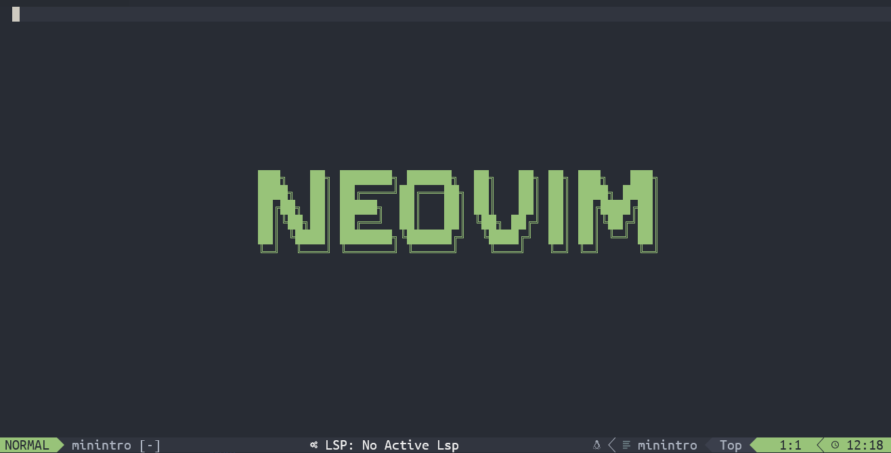

# Configure Neovim

You can follow the steps in this `README` file or read the blog [\[Start from scratch: Neovim\]](https://hangx-ma.github.io/2023/06/23/neovim-config.html) to configure Neovim.

<div class="dino" align="center">
  <table>
    <tr>
      <td>
      <td>
    </tr>
    <tr>
      <td align="center"><font size="2" color="#999"><u>Neovim: Statup Page</u></font></td>
      <td align="center"><font size="2" color="#999"><u>Neovim: Main Page</u></font></td>
    </tr>
  </table>
</div>

> [!NOTE]
> **_requirements.sh_** provides you a convenient installation method. Just run `. ./requirements.sh help` and follow the guidance. It may ask you privileged right to install necessary packages.
>
> **You must run the script under current shell environment using `. ./requirements.sh all`. Otherwise, the environment variables take no effect!**
>
> ```txt
> Usage:  [all|basic|component|help]"
>     all       - Install all packages"
>     basic     - Install basic component to support nvim functions(Default)"
>     component - Install component that you need"
>     help      - Show this usage guidance information\n"
> ```

> [!WARNING]
> I have tested all modules in the script but it possibly has some tiny mistakes that I haven't found. Please inform me if you figure out issues.

## System Support(Recommended)

- clipboard

  ```bash
  # support clipboard
  sudo apt-get install wl-clipboard
  ```

  > You can select your own clipboard support by looking at `:help clipboard-tool` in neovim.

## Update configuration files

- Move `nvim` folder into appropriate place or use the script to update configuration.

  ```bash
  git clone https://github.com/HangX-Ma/dotfiles.git
  mkdir ~/.config
  cp -r dotfiles/nvim ~/.config
  ```

- When you run `nvim`, **Lazy** package manager will install all neovim extensions automatically. You may encounter with some issues about a lack of dependencies. Just run the following command in neovim and follow the instructions provided by the **health report**.

  ```vim
  :checkhealth
  ```
